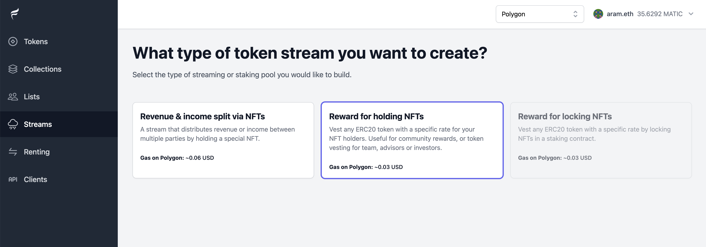
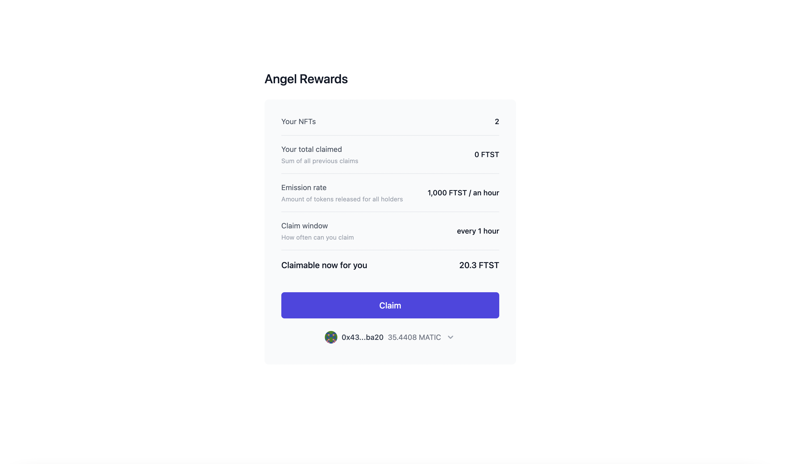

# Example: Airdrop rewards to your NFT community

This example React app uses Flair token streams to render a claiming widget for holders of your NFT collection to claim some ERC20 rewards over a specific period of time.

##### Dependencies

* `flair-sdk`: latest
* `react`: v17.x or v18.x

## :fire: Quick Start

1. Create a new stream in [Flair's dashboard](https://app.flair.finance/streams). Note that you will be the full owner of staking contract.
2. Make sure to create "Reward for holding NFTs"



3. Grab your contract address and chain ID, and update [App.tsx](./src/App.tsx):
   * Set `STREAM_CONTRACT_ADDRESS` to your deployed contract address you get from Flair's dashboard > Streams > your-stream > Deploy tab.
   * Set `STREAM_CHAIN_ID` depending on the contract chain. Use `1` for Eth mainnet, `4` for Rinkeby testnet, `137` for Polygon mainnet.
4. Clone the repo, install dependencies and run the react app in the `community-airdrop-reward-stream` directory:

   ```sh
   git clone https://github.com/0xflair/examples

   cd examples/react/community-airdrop-reward-stream

   npm install

   npm start
   ```

5. Open [http://localhost:3000](http://localhost:3000) to view it in the browser.



## 🔮 Tutorial

To use this example within your own React app:

1. Install `flair-sdk`:

   ```sh
   npm install flair-sdk
   ```

2. Configure FlairProvider around your root App:

   ```ts
   import { FlairProvider } from 'flair-sdk';

   // ...
      <FlairProvider>
         <App />
      </FlairProvider>
   // ...
   ```

3. Implement the claiming widget depending on your preferred customizability:
   * Easiest approach with minimum customizability you can copy the code within [App.tsx](./src/App.tsx).
   * To have your own layout you can use individual components as in [StreamClaimingSection.tsx](https://github.com/0xflair/typescript-sdk/blob/main/packages/react-token-streams/src/sections/StreamClaimingSection.tsx#L61)

4. *(optional)* To get the default styling you can install and configure [tailwindcss](https://tailwindcss.com/docs/installation/using-postcss):
   1. Install `npm install tailwindcss @headlessui/react @heroicons/react`
   2. Configure [tailwind.config.js](./tailwind.config.js)
   3. Configure [postcss.config.js](./postcss.config.js)
   4. Import tailwind in your [index.css](./src/index.css). Make sure your app imports the CSS `import './index.css';`.

5. *(optional)* If you're using Webpack 5 (e.g. React v17+) you need to manually configure Buffer for Coinbase wallet to work:
   1. Install `npm install react-app-rewired buffer`
   2. Then create a [config-overrides.js](config-overrides.js) to inject the Buffer.

6. Profit :rocket:
